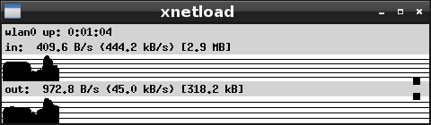
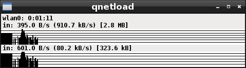

# qnetload
Note that this early stages of work in progress.

I still (2017) use xnetload and I think that the way that shows the information is extremely useful. Sadly xnetload was removed from Debian in 2010:
https://bugs.debian.org/cgi-bin/bugreport.cgi?bug=595195

I've evaluated many similar packages but I wasn't satifised with any of them, so if time permits I'll write a very similar xnetload using Qt (so I named it qnetload).

The user interface is very similar to xnetload (almost the same).

It only accepts one command line argument: the interface. xnetload had many options that I haven't implemented them. Note that to launch xnetload we had to do: "xnetload -i wlan0" and for qnetload is only "qnetload wlan0".

See the screenshots:
xnetload (the original one):

qnetload (this one):

