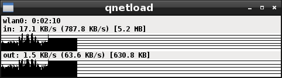

# qnetload
## Introduction
I still (2017) use xnetload and the way that shows the information is extremely useful for my use cases. Sadly xnetload was removed from Debian in 2010:
https://bugs.debian.org/cgi-bin/bugreport.cgi?bug=595195

Thanks R.F. Smith for programming the original xnetload!

I've evaluated many similar packages but I wasn't satisfied with any of them, so I wrote an xnetload replacement. I've named it qnetload as a tribute to xnetload and because it's implemented using the Qt libraries.

See the screenshots:
xnetload (the original one):


qnetload (this one):



## Installation
### Debian and Ubuntu
I've tested it on Ubuntu 17.04 Zesty but it should work with other Ubuntus as well.
On Debian I've tested it on a Debian 8.7 Jessie.

```
sudo apt-get install git cmake qt5-default
git clone https://github.com/cpina/qnetload.git
cd qnetload
mkdir build
cd build
cmake ../src
make
sudo make install
```

Then qnetload should be in your path and can be executed just typing qnetload on the command line.

If it doesn't work for you feel free to contact me (carles@pina.cat) or open a Github bug. Please include the output of the commands.

### Other distributions
qnetload should work with any Linux distribution if git (to make it easier to fetch, or use the "Download" option on Github), cmake and Qt5 are available.

Try to use your package management to install Qt5 (some equivalent of "sudo apt-get install qtbase5-dev" and then the steps in the "Debian and Ubuntu" section.

qnetload would work with any system providing that the file /proc/net/dev has the same structure as Linux.

## Features
These features were not available on the original xnetload but might be handy:

* The first time that qnetload is executed (if it doesn't have any arguments): it will automatically choose a network interface.
* Clicking on the interface name: changes the interface.
* If qnetload is executed again: it will try to use the most-recently monitored interface.
* Passing an interface name (e.g. "qnetload -i eth0") monitors the user interface regardless of the latest one used.

## TODO
I'd like to keep the user interface and way of working similar to xnetload so the TODO list tries to respect this.

* Be able to change between kiloBytes and kiloBits (same for the other units)
* Handle what happens if the monitored interface disappears.

If you would like something else let me know (create a bug or drop me an email).

Carles Pina i Estany (carles@pina.cat)
