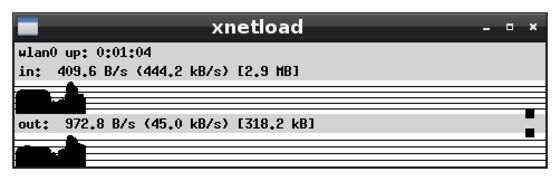
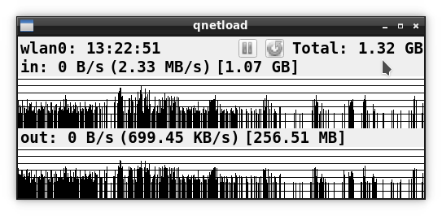
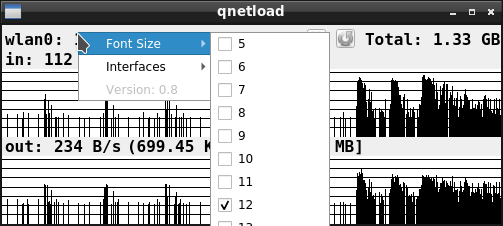

# qnetload
## Introduction
In 2016 and 2017 I used again (after years) xnetload. The way that xnetload shows the information is extremely useful in some cases. Sadly xnetload was removed from Debian in 2010:
https://bugs.debian.org/cgi-bin/bugreport.cgi?bug=595195

Thanks to R.F. Smith for programming the original xnetload!

I've evaluated many similar packages but I wasn't happy with any of them, so I wrote an xnetload replacement. I've named it qnetload as a tribute to xnetload and because it's implemented using the Qt libraries.

Since the initial implementation in 2017 I've added some minor new features: pause, restart, selection of interface using the user interface, etc.

See the screenshots below
xnetload (the original one):



qnetload (this one):



## Installation
### Debian and Ubuntu
I've tested it on Ubuntu 17.04 Zesty but it should work with other Ubuntus as well.
On Debian I've tested it on a Debian 8.7 Jessie.

```
sudo apt-get install git cmake qt5-default g++
git clone https://github.com/cpina/qnetload.git
cd qnetload
mkdir build
cd build
cmake ../src
make
sudo make install
```

Then qnetload should be in your path (probably installed in /usr/local/bin) and can be executed just typing qnetload on the command line.

If it doesn't work for you feel free to contact me (carles@pina.cat) or open a Github issue. Please include the output of the commands.

### Other distributions
qnetload should work with any Linux distribution if git (to make it easier to fetch, or use the "Download" option on Github), cmake and Qt5 are available.

Try using your package management to install Qt5 (some equivalent of "sudo apt-get install qtbase5-dev" and then follow the steps in the "Debian and Ubuntu" section.

qnetload would work with any system providing that the file /proc/net/dev has the same structure as Linux.

## Screenshots




## Features
These features were not available in the original xnetload but might be handy:

* Right click in any place to change the interface name and font size.
* Control+mouse wheel to also change the size of the font.
* Clicking on the interface name changes the interface.
* Click on some part of the graph to get information on the data used from that point to the current moment.
* Click "Reset" counter to reset totals.
* Click "Pause" to temporarily pause qnetload recording the in/out/total. The speed is plotted in grey but it doesn't affect the total/in/out/maximum bandwidth.
* Passing an interface name (e.g. "qnetload -i eth0") monitors the user interface regardless of the latest one used.
* The first time that qnetload is executed (if it doesn't have any arguments), it will automatically choose a network interface.
* The next time that qnetload is executed, it will try to use the most-recently monitored interface.

## TODO

* Be able to change between kiloBytes and kiloBits (same for the other units).
* Handle what happens if the monitored interface disappears.

If you would like something else let me know (create an issue or drop me an email).

Carles Pina i Estany (carles@pina.cat)

## Icons
Icons from: https://p.yusukekamiyamane.com (by Creative Commons Attribution 3.0 License)
